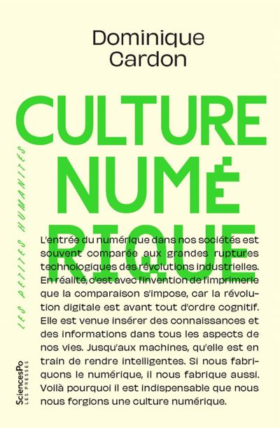

<h1>syllabus |</h1>

<table style="width: 100%">
  <colgroup>
       <col span="1" style="width: 15%;">
       <col span="1" style="width: 85%;">
  </colgroup>
  <tbody>
    <tr>
      <td style="vertical-align: top"></td>
      <td style="text-align: left">ce cours de <a href="./leprof">thomas tari</a>, inspiré de l'ouvrage <i>culture numérique</i> de dominique cardon paru en 2019, a été conçu pour vous aider à décoder les grands enjeux du numérique en mobilisant des connaissances en sociologie, anthropologie et histoire des sciences et des techniques ; en déployant une perspective sociotechnique, il propose d'analyser la co-construction des innovations technologiques et numériques et des transformations sociales et politiques des mondes que nous habitons, autour de huit thématiques</td>
    </tr>
  </tbody>
</table>

<h1>programme |</h1>

<table>
  <thead>
    <tr>
      <th style="text-align: left">cours</th>
      <th style="text-align: left">date</th>
      <th style="text-align: left">séance</th>
    </tr>
  </thead>
  <tbody>
    <tr>
      <td style="text-align: left" style="color:greenyellow">1</td>
      <td style="text-align: left" style="color:greenyellow">18 septembre</td>
      <td style="text-align: left" style="color:greenyellow">internet, une infrastructure sociotechnique</td>
    </tr>
    <tr>
      <td style="text-align: left" style="color:greenyellow">2</td>
      <td style="text-align: left" style="color:greenyellow">25 septembre</td>
      <td style="text-align: left" style="color:greenyellow">sociologie du lien hypertexte</td>
    </tr>
    <tr>
      <td style="text-align: left"><b>3</b></td>
      <td style="text-align: left"><b>2 octobre</b></td>
      <td style="text-align: left"><b>des états gafam ? économie politique des plateformes</b></td>
    </tr>
    <tr>
      <td style="text-align: left">4</td>
      <td style="text-align: left">9 octobre</td>
      <td style="text-align: left">penser le <i>digital labor</i></td>
    </tr>
    <tr>
      <td style="text-align: left">5</td>
      <td style="text-align: left">16 octobre</td>
      <td style="text-align: left">visions algorithmiques du monde</td>
    </tr>
    <tr>
      <td style="text-align: left">6</td>
      <td style="text-align: left">23 octobre</td>
      <td style="text-align: left">actualité des controverses de l'ia</td>
    </tr>
    <tr>
      <td style="text-align: left">7</td>
      <td style="text-align: left">6 novembre</td>
      <td style="text-align: left">en marge : les exclu·es du numérique</td>
    </tr>
    <tr>
      <td style="text-align: left">8</td>
      <td style="text-align: left">13 novembre</td>
      <td style="text-align: left">salut la commu ! créateur·ices, contenus et cultures</td>
    </tr>
  </tbody>
</table>

<h1>évaluation |</h1>

l'évaluation prendra la forme d'un examen final sur table de trois heures et consistera en une description sociotechnique d'un corpus documentaire consacré à un enjeu numérique, en mobilisant des notions du cours magistral ; les notes manuscrites ou imprimées sont autorisées

